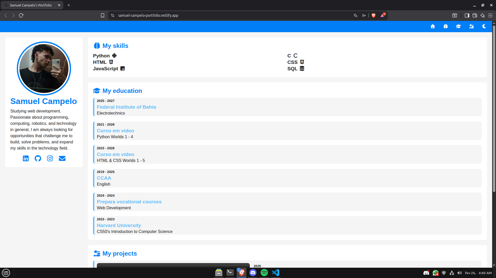
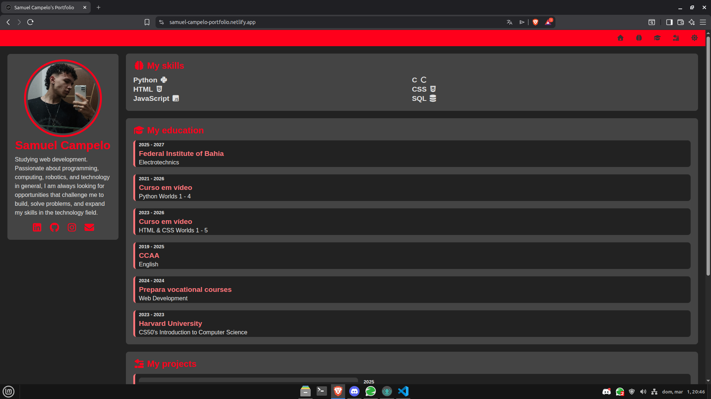

# Portfolio

## Description 📝

This is my personal portfolio, developed with a focus on simplicity, performance, and organization. 
The project was built using only pure HTML, CSS, and JavaScript, without the use of external frameworks or libraries.
The site presents information about me, my contact details, academic background, courses taken, technologies I use, and projects developed.
In addition, the portfolio was designed with special attention to user experience, responsiveness, and switching between light and dark themes.

## Features ✨

- 100% Responsive Layout ✅ 
- Switching between light and dark mode 🌗
- Clean and organized interface 🎨
- Structure designed for good organization and scalability 🧠

## Website preview 👀

   
   

## Contributions 🤝

Contributions are welcome! If you want to help improve this project, follow the steps below:

1. Fork the repository. 🍴
2. Create a branch for your feature (`git checkout -b my-feature`). 🌱
3. Make your changes and commit them (`git commit -m 'Add new feature'`). ✍️
4. Push to the branch (`git push origin my-feature`). 🚀
5. Open a Pull Request. 📥

## Visit the website 🌐

You can access the Portfolio directly at: https://samuel-campelo-portfolio.netlify.app/ 🔗
